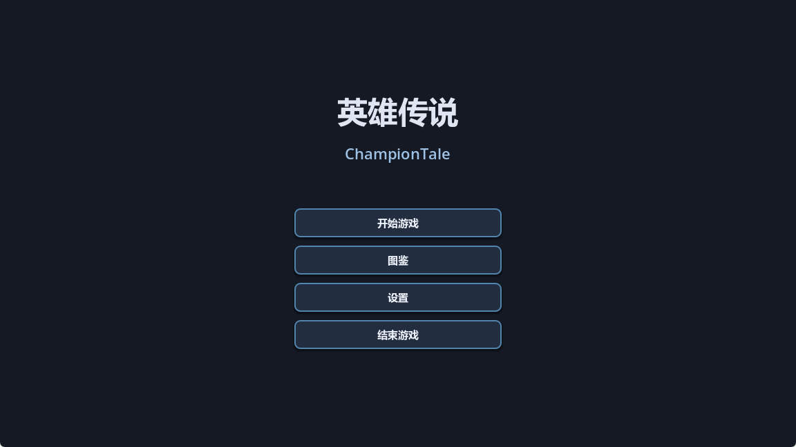
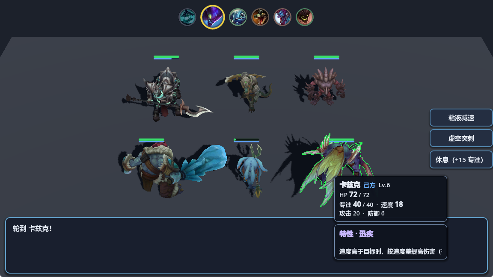
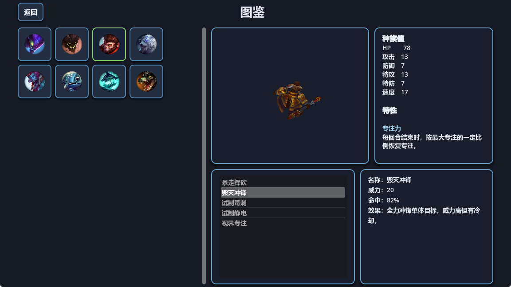

# ChampionTale（英雄传说）

单人开发的 **回合制、类宝可梦、肉鸽爬塔** 游戏原型与内容管线，使用 **Godot 4.6** 构建。当前仓库以 **战斗原型**、**图鉴** 与 **数据驱动配置**（单位 / 技能 / 特性 / 遭遇）为主，长期目标参见 `docx/gameplay-design.md`。

---

## 运行要求

- **Godot 4.6**（与 `project.godot` 中 `config/features` 一致）
- 工程默认使用 **Jolt Physics**、Windows 下渲染驱动为 **D3D12**（可在项目设置中按需调整）

克隆后直接用编辑器打开工程根目录，**主场景**为 `res://scenes/ui/main_menu.tscn`，按 F5 运行即可。

---

## 当前可玩内容

| 模块 | 说明 |
|------|------|
| **主菜单** | 开始游戏、图鉴、设置、退出；场景切换带淡入淡出（`SceneTransition` Autoload）。 |
| **战斗原型** | `scenes/combat/combat_prototype_demo.tscn`：全局行动顺序、技能与专注值、休息、战报与 HUD；3D 场地与单位模型、行动条与目标选择等。支持固定遭遇（`demo_encounter.tres`）或随机阵容池（`random_demo_pool.tres`）。 |
| **图鉴** | 浏览全部可参战单位：头像列表、SubViewport 内 3D 预览（Idle、等距视角、可选绕轴旋转）、种族值与特性、可学习技能及详情。 |
| **设置** | 窗口相关选项（由 `WindowSettings` Autoload 等配合）。 |

玩法与术语（回合 / 行动 / 专注值等）见 **`docx/gameplay-design.md`**；技能字段说明见 **`docx/skill-system.md`**。

---

## 截图

游戏截图放在仓库 **`docx/images/`** 下，便于 README 与对外说明共用。可按需替换为实际文件（保持文件名与下表一致，或修改下方 Markdown 中的路径）。

| 位置 | 建议文件名 |
|------|------------|
| 主界面 | `docx/images/main_menu.png` |
| 战斗画面 | `docx/images/combat.png` |
| 图鉴 | `docx/images/pokedex.png` |

> 若尚未放入对应 PNG，上述图片在 GitHub / 本地预览中会显示为裂图，属正常现象。

---

## 工程结构（简要）

| 路径 | 用途 |
|------|------|
| `battle/` | 战斗规则与数据类型：回合状态、结算、单位运行时、技能 / 特性资源脚本等（不直接绑具体场景节点）。 |
| `battle/definitions/` | `.tres` 遭遇、随机池、单位、技能、特性等数据。 |
| `scenes/combat/` | 战斗相关 `.tscn`。 |
| `scenes/combat/scripts/` | 战斗场景脚本与 UI / 3D 子控制器。 |
| `scenes/ui/` | 主菜单、图鉴、设置、场景过渡等。 |
| `components/` | 可复用组件（如动画驱动、图鉴用视觉目录等）。 |
| `assets/pokemon/` | 角色模型、头像 `portrait.png`、`avatar.tscn` 等。 |
| `docx/` | 设计文档与排错记录（如图鉴说明、导出注意事项、战斗数值约定）。 |

协作与代码约定见 **`AGENTS.md`**。

---

## 导出 Windows 可执行文件

工程内包含 **`export_presets.cfg`**（示例预设名 `ChampionTale`）。在编辑器中打开 **项目 → 导出**，选择对应预设并导出即可。

导出后若出现 **图鉴无数据**、**无法进入战斗** 等与资源加载相关的问题，可查阅 **`docx/export-pokedex-troubleshooting.md`**（目录枚举、`preload` 链、场景过渡 `await` 等说明）。

---

## 文档索引

- `docx/gameplay-design.md` — 类型定位、战斗术语、专注值、爬塔与队伍规则等  
- `docx/skill-system.md` — 技能资源字段与行为说明  
- `docx/pokedex.md` — 图鉴界面需求说明  
- `docx/battle-outline-postprocess.md` — 战斗描边后处理管线说明  
- `docx/battle-stat-stages.md` — 战斗能力阶段（Stat Stages）、物/特/变化与 HP 约定  
- `docx/export-pokedex-troubleshooting.md` — 导出构建与图鉴 / 遭遇预加载问题记录  

---

## 许可

未在仓库内统一声明；使用或分发前请与仓库所有者确认授权。
